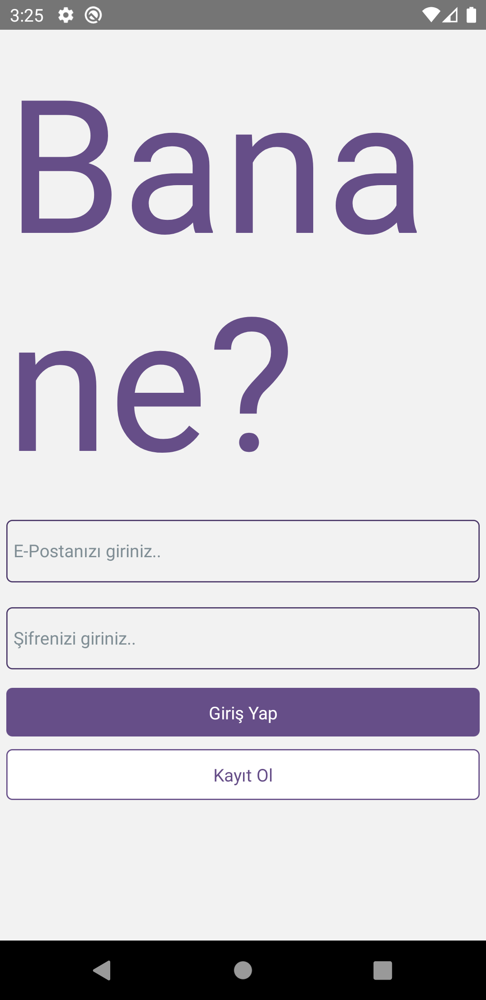
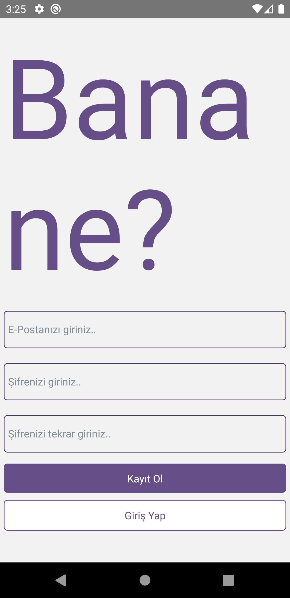
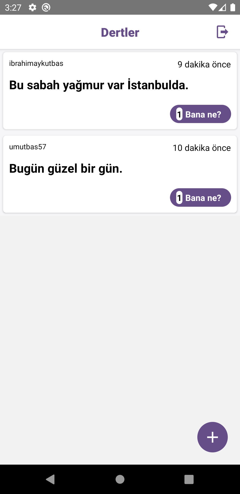
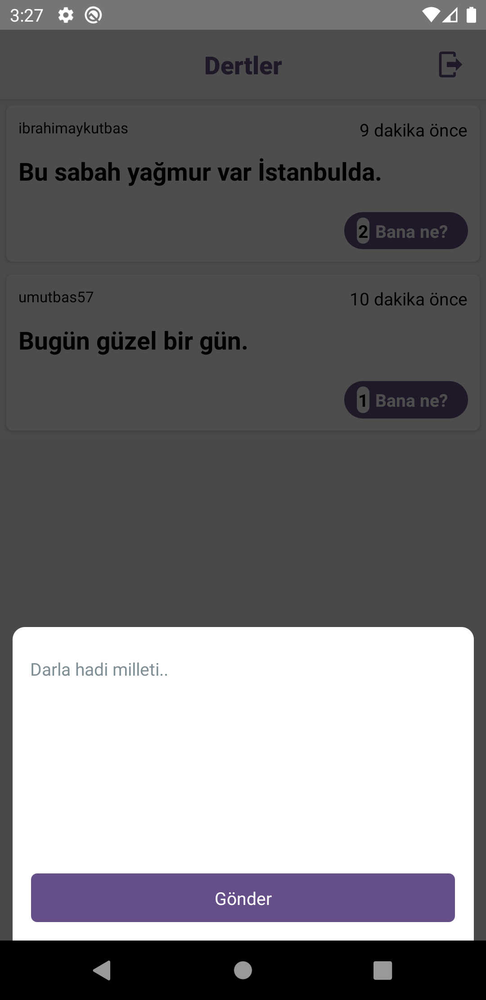

# Bana Ne?

    

## Kurulum

React Native

## Tools

- Firebase
- React Navigation
- Formik
- React Native Flash Message
- React Native Modal
- React Native Vector Icons

## Özellikler

- Kayıt formu ile sisteme üye olabilmek.
- Kayıt olunan bilgiler ile sisteme giriş yapabilmek.
- Tweet atma mantığı gibi fikirlerin belirtilebilmesi.
- Paylaşılan yazıların listelenmesi.
- Paylaşılan yazılara tatlı bir olumsuzluk olarak 'Bana ne?' butonu ile etkileşime girebilmek.

## Başlangıç

Bu depoyu yerel makinenizde klonlayın.

```
git clone https://github.com/ibrahimaykutbas/Banane.git
```

### Kullanım

Projeyi klonladıktan sonra kullanmak için:

```
cd Banane
cd .
```

Proje bağımlılıklarını yüklemek için proje klasörüne aşağıdaki komutları çalıştırın.

```
npm init
npm install
```

Bu talimatlar, geliştirme ve test amacıyla yerel makinenizde projenin bir kopyasını hazır ve çalışır hale getirecektir.

## Kullanılabilir Komut Dosyaları

Proje dizininde şunları çalıştırabilirsiniz:

```
npx react-native run-android
```

## Daha Fazla Bilgi İçin

Daha fazlasını şuradan öğrenebilirsiniz: [React documentation](https://reactnative.dev/)
